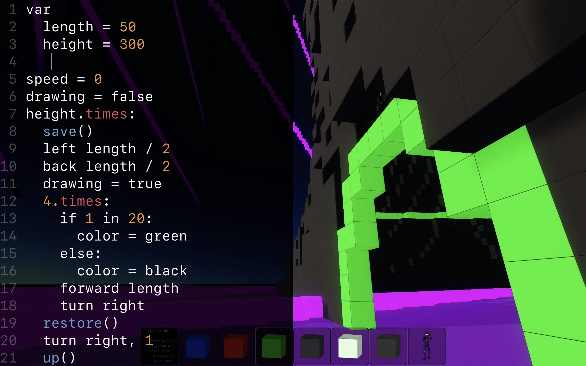

# Enu

Build 3D worlds in Nim.

Enu lets you build and explore worlds using a familiar block-building interface
and a Logo inspired API. It tries to make 3D development easier, and will
eventually be able to create standalone games.

Visit [getenu.com](http://getenu.com), or join us on [Discord](https://discord.gg/KTjhgtKgQS).
