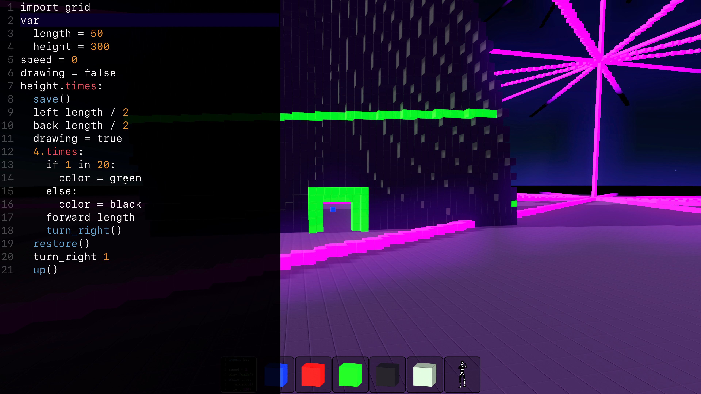
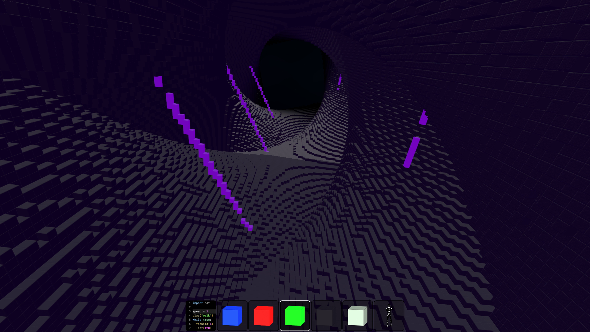
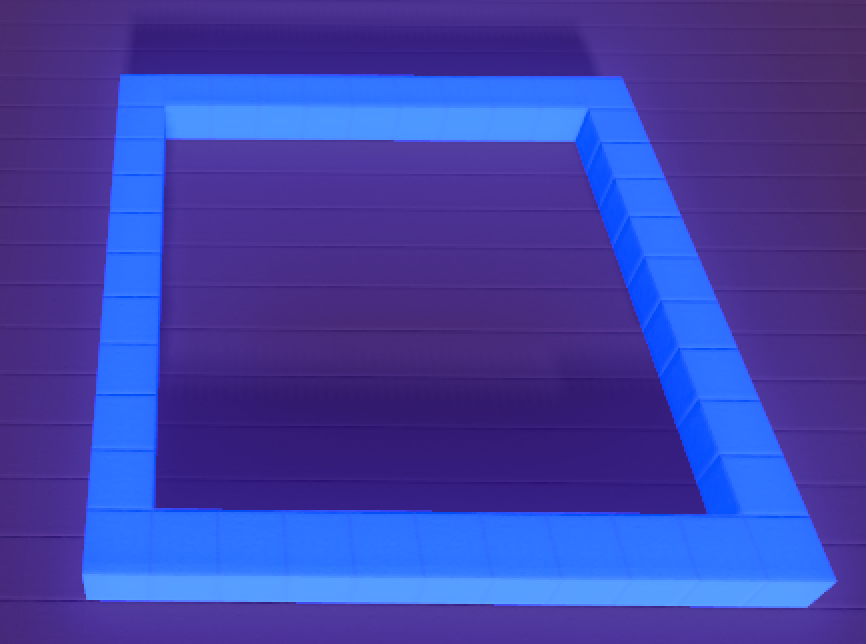
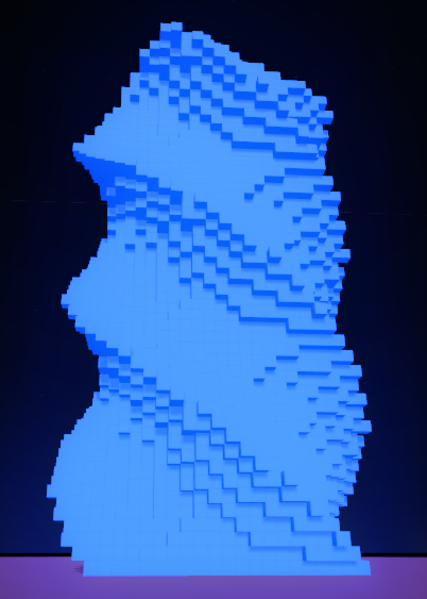
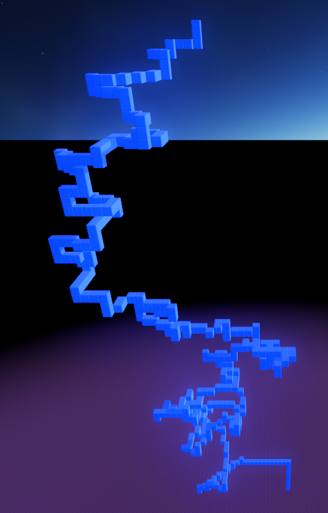
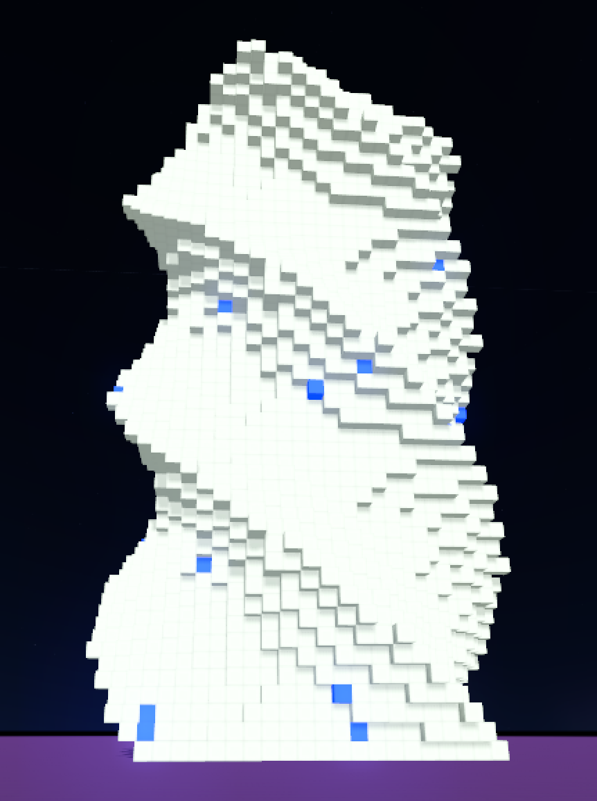
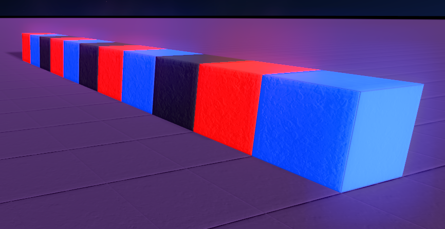

# Enu

3D live coding, implemented in Nim.



Enu lets you build and explore worlds using a familiar block-building interface and a Logo inspired API.
It aspires to make 3D development more accessible, and will eventually be usable to create standalone games.

*Note: The docs for Enu 0.2 are a work in progress. Most of the core ideas are here, but a fair bit of revision
is required. The 0.2 docs will be targeted towards new programmers, with 'Note for Nimians` sections aimed at more
experienced folks to explain what's really going on. However, things are all over the place right now, with the
intended audience changing paragraph by paragraph.*

*Notes for Nimians: Enu tries to simplify some Nim concepts, mainly to defer explaining unfamiliar terms. In particular,
Enu tries to hide most things related to types, calls procs 'actions', and avoids immutable variables. I believe this is
the right approach for new programmers, but I expect that more sophisticated developers will use a style closer to
traditional Nim.*

# Goals

Enu is meant for anyone who wants to explore, experiment, or make games, but particular care has been taken to make
it usable by younger people who may struggle with reading or typing. However, rather than bypassing the keyboard with
a Scratch-like visual programming language, Enu attempts to reduce and simplify the keystrokes required for a text-based
language, while hopefully preserving most of the tremendous flexibility text-based code offers.

With this in mind, Enu tries to:

- Reduce nesting. Instead of defining a `class` and nesting code inside of it, Enu lets you
  specify a `name` at the top of a script, and everything following is assumed to be part of the definition.

- Reduce the use of the shift key. Lower case is used almost everywhere. Commands are designed to
  avoid underscores and parenthesis. By default (for now at least), a `;` keypress is interpreted as `:`, as colons are
  required frequently in Nim (and require shift, at least on US English keyboards) while semi-colons are not.

- Omit or shorten identifier names. `me` instead of `self/this`. `-` instead of `proc`. `5.times:` or `5.x:` instead of
  `for i in 0..5:`. Single letter shortcuts for many common commands.

- Pretends to avoid types. Enu code is Nim code and is statically typed, but a fair amount of effort has been spent
  hiding this fact. Types are great, but are confusing for new programmers.

- Spatial organization. No files. Code is text, but it's accessed through an object in the virtual world.

- Avoids events. Tries to make all flow based on loops and conditionals.

# Demo

[Potato Zombies: Helping a 6 year old build a 3D game with Enu and Nim](https://fosdem.org/2022/schedule/event/nim_potatozombies/)

[Building 3D Games with Enu 0.2 - NimConf 2021](https://youtu.be/ECJsq7BeZ8w)

[Enu 0.1 demo video](https://youtu.be/upg77dMBGDE):

[](https://youtu.be/upg77dMBGDE)

### Outdated Demos

- [Enu 0.01 Intro and Demo](https://youtu.be/AW0PT9j976s)
- [Introducing Enu - NimConf 2020](https://youtu.be/3l6tsKM1cY8)

# Programming Enu

## Units

Entities/objects in Enu are referred to as units, and have a base type of `Unit`. Currently there are `Build` units
(voxel objects) and `Bot` units (the robot). There will be more in the future.

`me` is the unit that owns a script, and is equivalent to `self`/`this` in other environments. `me` was selected
because it's easier for a child to type. `me.` can be auto-inserted when accessing properties of the unit. For example,
`me.speed = 10` would commonly be written as `speed = 10`. There are probably bugs with this behavior.  Please report
them.

## Prototypes

Enu uses a prototype based object system for units. To allow a unit to be a prototype, you give it a name:

`name ghost`

Then create a new instance in a different script with `.new`:

`var ghost2 = ghost.new`

You can also provide parameters, which can be overridden when creating a new instance:

`name ghost(color = white, speed = 5, spookiness = 10)`

These become properties of the unit (ie `me.spookiness = 5`), but can be treated like variables in the unit's script
due to auto `me` insertion (`spookiness = 200`).

To create a new instance with specific property values:

`var ghost2 = ghost.new(spookiness = 11)`

Parameters can have a default value (`spookiness = 10`), which makes them optional when creating a new instance. If they
should be required, or there's no reasonable default value to use, specify a type (`spookiness: int`) instead, or omit
both the value and the type, which will make the type `auto`. Because `auto` can be implicit, `name ghost(a, b: int)`
treats parameters differently than `proc ghost(a, b: int)` would. With the proc, `a` and `b` are both `int`, whereas
the `name` version would make `a` `auto` and `b` `int`.

`speed`, `color`, `global` can always be passed to a new instance, even if the prototype name doesn't include them.

## Random numbers

Generally, if an Enu command takes a number, it will be a `float`. However, `int` will auto-convert to `float`, and
when a numeric `Range` is passed to something expecting a number, a random value within the range will be selected. So, even
though `forward` expects a `float`, the following are all valid:

```nim
forward 1.0
forward 1
forward 1.0..5.0 # Convert to a random float between 1.0 and 5.0
forward 1..5 # Convert to a random int between 1 and 5, then convert the int to a float
```

The `in` operator can be used between two numbers to test for random chance, for example:

```nim
if 1 in 2:
  echo "I should be hit 50% of the time"
if 1 in 100:
  echo "I should be hit 1% of the time"
```

By default random numbers in Enu are based partially on the time and will be different each time a script is executed.
However, sometimes you want randomness to create variety, but want the same values to be chosen each time a script is
run. This is especially important when using randomness in a `Build` that you plan to manually edit later. To ensure the
same values are selected each time a script is run, set the unit's `seed` property to some integer of your choosing,
ie `seed = 12345` or `me.seed = 54321`.

Any child units instanced by a unit with a seed value will get the same seed by default. However, it will still get
a unique random number generator, so changing the script for a child object won't impact the random numbers selected by
the parent.

# Commands

## `move/build`

When dealing with a `Build` unit, commands can do different things depending on whether the unit is in `build`
mode or `move` mode. `move` mode moves the unit around, while `build` creates new blocks. By default a `Build` is in
`build` mode. Often you'll pass the `me` unit to `move/build`, but it's also possible to pass other units. For example:

```nim
build me # generally not required, as it's the default

# make a shape:
back 5
right 3

# move it into position:
move me
up 3

# create another unit and add some blocks
var enemy = ghost.new
build enemy
down 5

# move it into position
move enemy
up 5
```

It's also possible to call commands directly against a unit instance, but they will always use `move` mode, regardless
of which mode is in use:

```nim
build enemy
up 5 # build 5 blocks up
enemy.up 5 # move up 5
```

## `forward/back/up/down/left/right`

Move or build x number of blocks in the specified direction. Defaults to 1 block.

```nim
forward 5
enemy.up 2
```

## `turn`

Turn a unit. Can be passed:
- a number in degrees. Positive for clockwise, negative for counter-clockwise. Ex. `turn 180`
- a direction (`forward/back/up/down/left/right`) which will turn in that direction. 45 degrees by default.
  Ex. `turn left`, or `turn up, 180`
- a unit, which will turn towards that unit. Ex. `turn player`
- a negative unit, which will turn away from that unit. Ex. `turn -player`

## `near(less_than = 5.0) / far(greater_than = 100.0)`

Returns true or false if a unit is nearer/farther than the specified distance. For example:

```nim
if player.near:
  echo "the player is 5m or closer"

if player.far:
  echo "the player is 100m or farther"

if player.near(10):
  echo "the player is 10m or closer"

if player.far(25):
  echo "the player is 25m or farther"
```

## `hit`

If a unit is touching another unit, return the vector of the contact. Defaults to testing against `me`. For example:

```nim
if player.hit:
  echo "I'm touching the player"

if player.hit == UP:
  echo "The player is on top of me"

if player.hit(enemy1):
  echo "The player hit enemy1"
```

## `position/postion=`

Gets or set the position of a unit as a Vector3. `me` by default.

```nim
if player.hit(enemy):
  # if the player hits `enemy`, reset the player position to the center of the world.
  player.position = vec3(0, 0, 0)
```

## `start_position`

The starting position of a unit. Missing currently, but will be in in 0.2.

## `speed/speed=`

Gets or sets the speed of a unit. `me` by default.

While building, speed refers to the number of blocks placed per frame. In the future this will be normalized to 60fps,
but currently the speed is tied to the framerate. Setting speed to 0 will build everything at once.

While moving, this is the movement speed in meters per second.

Switching between build and move mode doesn't impact the speed, except in the case of switching to move mode from build
mode with a speed of 0. `speed = 0` is extremely common for build mode, but makes things appear broken in move mode,
as nothing will actually move, so switching to move mode with a speed of 0 will automatically reset the speed to 1.

## `scale/scale=`

Sets the scale/size of a unit. `me` by default.

## `energy/energy=`

Specifies the "glow" of a unit. `me` by default. Currently does nothing for bots, but will in the future.

## `global/global=`

Specifies if a unit is in global space, or the space of its parent. If `global = true` and the parent unit moves,
child units are unaffected. If `global = false`, the child will move with its parent. Does nothing for top level units,
as they're always global.

By default, new `Build` units are `global = false` and new `Bot` units are `global = true`.

## `rotation`

Gets the rotation of a unit as a Vector3.

## `velocity/velocity=`

Gets or sets the velocity of a unit, as a Vector3. Currently buggy.

## `color/color=`

Gets or sets a units color. `me` by default. For `Build` units, this only impacts blocks placed after the property
is set. For `Bot` units this does nothing, but in the future it will change their color.

## `bounce`

Bounces a unit in the air. Currently only works for the player.

## `save/restore`

`Build` units only. `save` the position, direction, drawing state, and color of the draw point, to `restore` it later.
Can optionally take a name string to enable saving/restoring multiple points.

## `reset`

Instantly return unit to start position and resets rotation and scale.

## `home`

Moves a unit to its start position via a `forward`, `left`, `down` sequence with appropriate values. Can fail if there
are obstructions along the way. Compare `position` to `start_position` after running to test for success.

## `sleep(seconds = -1.0)`

Do nothing for the specified number of seconds. If no argument is provided, or the argument is < 0, this will wait for
0.5 seconds or until unit is interrupted, which will end the `sleep` prematurely. This allows the following:

```nim
forever:
  sleep()
  if player.hit:
    echo "ouch!"
```

Currently, any collision will trigger an interrupt. This will be expanded in the future.

## `forever`

Alias for `while true`

## `cycle`

Alternate between a list of values, returning the next element each time the cycle is called.

```nim
forever:
  sleep 1
  echo cycle("one", "two", "three")
```

# Shorthand Commands

Many Enu command also have a 1 or 2 letter alias. This is harder to read, but can reduce friction for folks new to
typing.

The aliases are:

- `f` - `forward`
- `b` - `back`
- `l` - `left`
- `r` - `right`
- `u` - `up`
- `d` - `down`
- `t` - `turn`. Can be combined with shorthand directions, so `turn right` can be expressed as `t r`
- `o` - `while true:` (o was selected because its shape is a loop)
- `x` - `times`. `5.x:` will run a code block 5 times.

In action:

```nim
# draw a cube (with no top)
10.x:
  4.x:
    f 10
    t r
  u 1
```

# Actions

Procedures/functions in Enu are referred to as actions, mainly to avoid explaining the term procedure, subroutine, or
function, and to tie them to [Action Loops](#action-loops) defined below. Their syntax resembles markdown lists, and
have the same parameter rules as [prototype](#prototypes) names. That is, mostly the same
as Nim procs, but types can be omitted, making the parameter implicitly `auto`.

```nim
- hello(name):
  echo "hello ", name

- goodbye(name = "Vin"):
  echo "goodbye ", name

hello "Claire"
goodbye "Cal"
```

Action parameters are automatically shadowed by a variable with the same name and value, making them mutable within the
action. Enu tries to avoid the concept of immutable values.

It's also possible to specify a return type between the closing bracket of the parameter list and the colon:

```nim
- hello(name) string:
  "hello " & $name

echo hello("Scott")
```

However, at this point it's probably better to use a `proc`.

# Action Loops

*Note for Nimians: Action Loops are state machines, and any proc can be a state. If the proc has a return value it will
be discarded.*

Action Loops can help control the complexity of the logic for your units. They allow you to run complicated lists of
actions and switch between them easily when situations change.

You can create your own [actions](#actions), or you can call any of the built-in Enu [commands](#commands) like
`forward`, `back`, `turn`, `sleep`, etc.

## `loop`

An Action Loop always has one and only one current action, which it will call repeatedly until you switch to some
other action. The default action is `nil`. The first thing a loop must do is switch from `nil` to another action, using
the little switch arrow `->`.

```nim
loop:
  nil -> forward
  # I'll go forward forever!
```

The little switch arrow (`->`) will switch from the action on the left to the action on the right if it's encountered
and the left action has just completed. If the loop goes through and no switches match, the current action will be
run again.

We can control which switches get run by putting them in `if` statements.

```nim
loop:
  nil -> forward
  if player.far:
    forward -> back
  if player.near:
    back -> forward
```

In the above example, the loop immediately switches to `forward`, and will go forward indefinitely until one of the
conditions is met and the action is switched to something else. If the player gets too far away (more than 100m) and
the action is `forward`, the action will be switched to `back`. If the player is near (5m) and the action is `back`,
it will switch to `forward`. However, if the player is near and the action is `forward`, nothing will change. The
`if player.near` statement will be true, but `back -> forward` is ignored, since the current action isn't `back`.

If you want your loop to end at some point, you can switch back to `nil`:

```nim
loop:
  nil -> forward(10) # Some actions can take additional parameters.
  forward -> nil
  # I'll run `forward(10)` a single time, then stop and end the loop.
```

Let's look at something more complicated, and introduce the big switch arrow (`==>`) and change actions.

```nim
- wander:
  speed = 1
  forward 5..10
  turn -45..45

- charge:
  speed = 5
  turn player
  forward 1

- flee:
  speed = 3
  turn -player
  forward 1

- attack:
  player.bounce 5
  turn 360

var health = 3

loop:
  nil -> wander
  if 1 in 50:
    # when each `wander` action finishes, there's a 1 in 50 (2%) chance of our unit getting a sudden
    # burst of energy and switching to the `charge` action. Otherwise we just keep wandering.
    wander -> charge

  if health == 0:
    # we died. Exit the loop. We want this to happen immediately, not after the action finishes, so we use
    # the big switch arrow. We use the special `any` action to say that this should happen regardless
    # of the running action.
    any ==> nil

  if player.hit:
    # if the player touches us while we're wandering, we flee. We want it to happen the instant the player touches us,
    # not when our current `wander` is done, so we use the big switch arrow
    wander ==> flee:
      # this is a change action. If the action switches here, the change action will also run once.
      health -= 1
    # if the player touches us while we're charging, we attack immediately.
    charge ==> attack

  if player.far:
    # if we're fleeing the player, we go back to wandering when they get far away
    flee -> wander

  # Switch to wander when our attack is done. We always want this to happen, so it isn't in a
  # conditional. It only does anything if the current action is `attack`, and we only do it when
  # the attack is done becuase we're using the little switch arrow
  attack -> wander

```

## Child Loops

Actions are generally just a simple lists of commands. It's fine to put logic in them, but anything complicated
will quickly get unwieldy. Imagine we have a unit that performs two complicated actions, `find_treasure` and
`fight_monster`. `find_treasure` might need to `navigate` an area, `locate` items of interest, `interact` with them,
then return to `home_base` to deposit them. `fight_monster` could require actions like `evade`, `attack`, `hide`, and
`flee`.

Combining all of this in a single action loop would give us a lot of actions, many of which are mostly unrelated,
and managing our switches could get very complicated. However, making them entirely separate isn't ideal either, as
there's probably some common functionality between them (die if our health gets too low, respawn if we get stuck). We
also need to switch between the two actions.

A good way to manage this is by making `find_treasure` and `fight_monster` child loops rather than regular actions.
We can treat them like regular actions in our main `loop`, but when we switch to them they'll be able to perform
more sophisticated logic than a normal action could. In addition, our main loop will continue to run along side
the the child loop, so we can quickly switch out of the child loop with a big switch arrow `==>` in response to
certain conditions, without either loop needing to worry about higher level concerns.

Our main loop could look something like this:

```nim
loop find_treasure:
  # our treasure logic goes here. This loop doesn't have an exit condition.
  if treasure_found:
    # We found it. Start looking again. This will switch from any action apart
    # from `look_for_chest`
    others ==> look_for_chest

loop fight_monster:
  # fight logic here. This loop should exit when the monster dies
  if monster.dead:
    any ==> nil

loop:
  # We want our unit to find_treasure indefinately. `find_treasure` doesn't exit (switch to nil)
  nil -> find_treasure
  if monster.near:
    # find_treasure doesn't need to know anything about monsters. We can break out of it
    # with a big switch arrow if we encounter one.
    find_treasure ==> fight_monster

  # fight_monster does have an exit condition (the monster dies), so we can wait for it to finish
  # using the little switch arrow, then go back to finding treasure.
  fight_monster -> find_treasure

  if health == 0:
    # if our health drops to 0, it doesn't matter what else we're doing. Die immediately. Break out
    # of any action (except die) with a big switch arrow.
    (any, -die) ==> die

    # this would also work:
    # others ==> die
  if stuck:
    # respawn if we're stuck, but only from our two child loops. We don't want to respawn if we're
    # already respawning, or we're dead. Implementation of `respawn` not shown.
    (find_treasure, fight_monster) ==> respawn

  # we're done respawning. Treasure time!
  respawn -> find_treasure
```

Child loops can also call other child loops, in which case both the parent and grandparent loops can use `==>` to break
out of the top level loop. There's no set limit to nesting depth.

## `->` Little Switch Arrow

Switches from one action to another, after the first action has finished running.

```nim
draw_box -> draw_stairs
```

## `==>` Big Switch Arrow

Switches from one action to another immediately. Will interrupt the running action.

```nim
if player.near:
  sleep ==> offer_quest
```

## More about Action Loops

### `as`

Actions are just procedures, and they can take parameters. Sometimes you want to run the same action
in different situations with a different action name. You could do this by creating a new action that
calls the first one, but you can also use `as` to give an action a different name.

```nim
# explore action and health var not shown.
- flee(distance = 100):
  turn -player
  forward distance

loop:
  nil -> explore
  if player.near and health > 2:
    explore -> flee
  elif player.near and health <= 2:
    explore ==> flee(200) as really_flee
  if player.far:
    flee -> explore
  if player.far(150):
    really_flee -> explore
```

### Special from actions

Often loops will switch from a single action to another. However, sometimes you want to allow switching from
a variety of actions.

- `any -> some_action` - switch from any action to the target action. This will switch (and run any change action)
  even if we're already running the target action. In this example we used a little switch arrow, so it still won't
  happen until the current action actually completes.
- `others -> some_action` - Same as `any`, but it excludes the target action.
- `(action1, action2)` - Multiple from actions can be supported by putting them in a tuple.
- `(any, -action2, -action3)` - Switch from any action except `action2` and `action3`.

### When do action loops run?

An action loops will run whenever its executing action finishes. In addition, action loops will run
every 0.5 seconds, and when something triggers an interrupt. Currently only the start and end of a collision with the
player trigger an interrupt, but this will be expanded.

When using child loops, the top level loop runs first, then walks down the stack of loops until the currently executing
loop is reached.

# Examples

*TODO: Include examples of new 0.2 functionality*

Draw a square:
```nim
forward 10
right 10
back 10
left 10
```
or:
```nim
4.times:
  forward 10
  turn_right()
```

Create a twisting tower:
```nim
var
  length = 20
  height = 50

height.times:
  left length / 2
  back length / 2
  4.times:
    forward length
    turn right
  forward length / 2
  right length / 2
  turn 5
  up 1
```


Draw randomly:
```nim
up 10
forward 10
(50..100).times:
  forward 2..5
  turn -180..180
  up 0..2
```


Set the color to blue randomly with a 1 in 50 chance. Otherwise set it to white:
```nim
if 1 in 50:
  color = blue
else:
  color = white
```
or as a one-liner:
```nim
color = if 1 in 50: blue else: white
```


Move forward 10 times, cycling through colors:
```nim
10.times:
  color = cycle(red, black, blue)
  forward 1
```


# Install

Download from https://github.com/dsrw/enu/releases. The Windows version isn't signed, and
UAC will warn that it's untrusted. This will be fixed in a future release.

The Linux version hasn't been tested particularly well, but it works for me under Ubuntu 20.04. Please report any issues.

The world format will change in a future release. Worlds created in 0.1 won't be supported in future versions.

# Build and Run

```console
$ nimble prereqs
$ nimble build
$ nimble import_assets
$ nimble start
```

## Notes

Enu requires a custom Godot version, which lives in `vendor/godot`. This will be fetched
and built as part of `nimble prereqs`.

See https://docs.godotengine.org/en/3.2/development/compiling/index.html

# Usage

## Keyboard/Mouse

- `ESC` - toggle mouse capture and to dismiss editor windows. Reloads script changes.
- `W, A, S, D` - move around when mouse is captured.
- `Space` - jump. Double jump to toggle flying. Hold to go up while flying.
- `Shift` - run.
- `C` - go down while flying.
- `~` - toggle the console.
- `F` - toggle fullscreen.
- `1` - enter edit mode.
- `2 - 9` - change active action.
- `Mouse Wheel Up/Down` - change active action.
- `Alt` - reload script changes. Hold to temporarily capture the mouse and move, so you can
  change your view without having to switch away from what you're doing.
- `Cmd+P / Ctrl+P` - Pause scripts.
- `Cmd+Shift+S / Ctrl+Shift+S` - Save and reload all scripts, then pause. If you have a script that makes a unit
  inaccessible (ex. moves the unit below the ground) this is a way to get things back to their start positions so they
  can be edited.
- `Left Click` - Place a block/object or open the code for the currently selected object.
- `Right Click` - Remove a block/object.

## XBox / Playstation Controller

- `Left Stick` - move.
- `Right Stick` - change view.
- `A / X` - jump. Double jump to toggle flying. Hold to go up while flying.
- `B / ◯` - go down while flying. Dismiss code editor.
- `Y / △` - toggle edit mode.
- `L1 / R1` - change active action.
- `L2` - place a block/object or open the code for the currently selected object.
- `R2` - remove a block/object.
- `L3` - run.

Enu currently includes 6 block types/colors, and 1 object model (a robot). This will be greatly
expanded in the future.

## Building

Drop a block or robot with the left mouse button/controller trigger, remove it with the right. Adjoining blocks will be
combined into a single structure. With the mouse captured, building works more or less like MineCraft. Release the mouse
by pressing ESC to draw blocks using the mouse cursor.

Code by switching to the code tool by left clicking/triggering on an object or structure. Changes are applied when the
code window is closed (ESC key) or CTRL is pressed. Holding CTRL will also temprarly grab the mouse and allow you to
change your position.

# Config

The Enu data directory lives in `~/Library/Application Support/enu` on Mac, `%AppData%\enu` on Windows, and
`~/.local/share/enu` on Linux. `config.json` has a few configurable options:

`mega_pixels`: The render resolution, in mega pixels. Increase for more detail. Decrease for better performance.

`font_size`: The font size. DPI is currently ignored, so hidpi screens will require a higher number.

`dock_icon_size`: Size of the icons in the dock. DPI is currently ignored, so hidpi screens will require a higher number.

`world`: The world/project to load. Change this to create a new world.

`show_stats`: Show FPS and other stats.

`semicolon_as_colon`: Both `;` and `:` will be interpreted as `:`, allowing `:` to be typed without shift. Sometimes useful for new typists.

# TODO for 0.2

### Child unit edits

Enu aims to make it easy to combine procedural and manual content. It's fairly easy to make a simple building with a
script, then manually add windows, doors, and other adornments. When the script runs again, as long as it generates
the same basic shape, manual edits should be preserved.

This doesn't really work properly for nested objects. Currently, all edits, even for child units, are saved to the top
level unit, because child units are ephemeral and get recreated each time a script is run. This works in many cases,
but falls down if the child unit is rotated, scaled, out of alignment with the parent, moving, or if the parent
unit is a `Bot` rather than a `Build`.

This will be reimplemented in a way that properly associates child edits with their proper unit, but worlds created with the
current system might lose some edits when loaded in 0.2.

### Clean up manually removed procedural blocks

Somewhat related to the above, Enu saves manual edits made to procedural units and tries to reapply them if the unit
is regenerated. In addition to saving placed blocks, which is fairly straightforward, Enu also saves the position
of removed blocks. Enu 0.1.x had a system for cleaning these up if a unit was regenerated and the removed block
no longer matched a procedural block, but 0.1.99 keeps them around forever. Something will be done to clean them up.

### Lighting

At some point I mistakenly changed something with lighting/colors and everything now looks highly oversaturated. This
will be fixed.

### Pivot point

Currently it isn't possible to change the pivot point for a unit, and the default point isn't properly centered for
most builds, making it difficult to rotate builds nicely. Enu 0.2 will use the draw point for the pivot point, allowing
it to be moved, and will shift everything over 0.5m, allowing most builds to rotate in a balanced way. There will
also be a command to move the draw point (and thus the pivot point) in the exact center of a build.

### Moving child builds from a parent build

Creating a child build with a parent build, then attempting to move the child causes the child to disappear. I have no
idea why. This will be fixed.

### Testing and bug fixes

Enu has been under heavy development for a year without a great deal of testing, so there are undoubtedly bugs. I
believe these will be minor, but there are probably a fair number of them.

### v0.2.x - v0.3

- [ ] iOS support.
- [ ] Move script execution off the main thread.
- [ ] Inventory
- [ ] Settings UI
- [ ] Allow the editor pane and action bar to be resized from within Enu.
- [ ] Better collision support
- [ ] Blocks of any color
- [ ] In game help
- [ ] Easy way to switch worlds in-game
- [ ] Support loading worlds from anywhere, not just the Enu data directory
